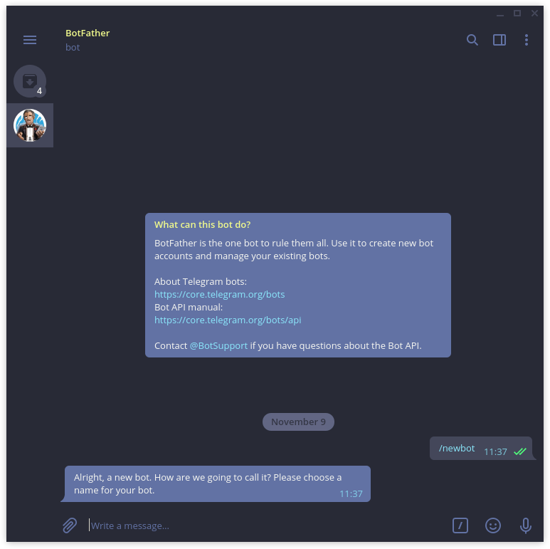
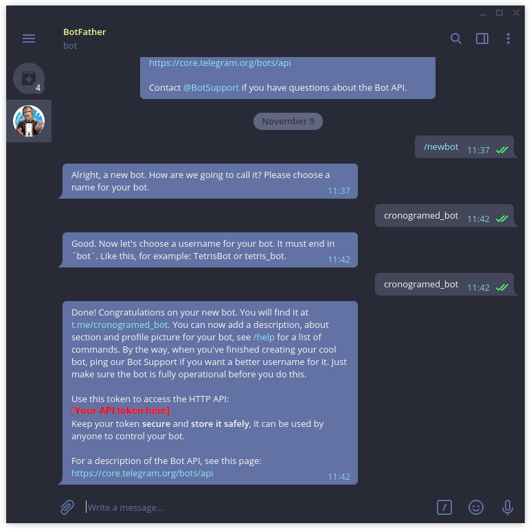
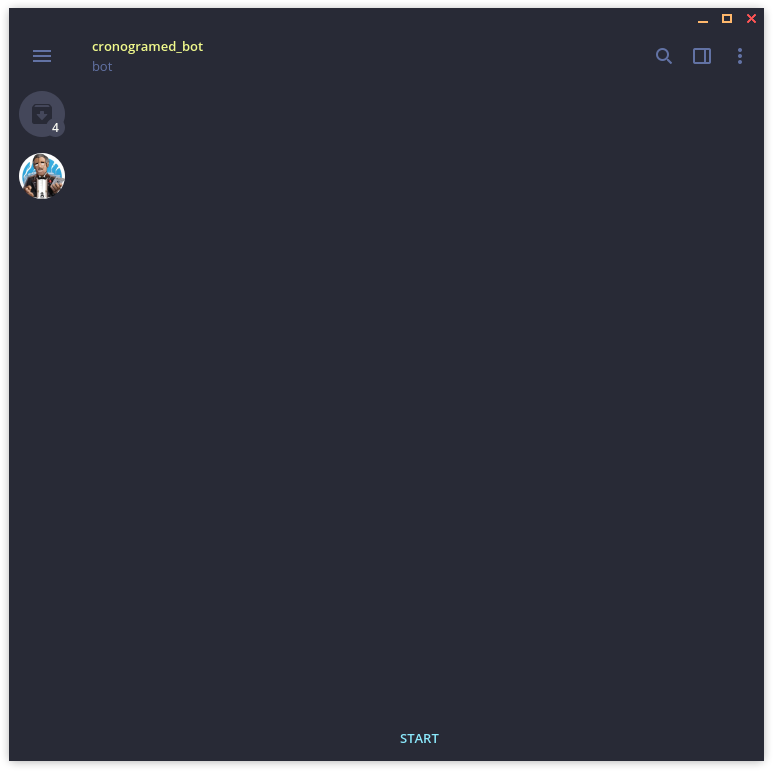

# Cronogram
Your trustworthy ```cron task``` notifier.

## Goal

Because you never know if your ```cron task``` has been successful, this **software** is there to notify at the exact moment the task is completed, wherever you are thanks to the use of [Telegram](https://telegram.org/) and this [package](https://pypi.org/project/telegram-send/)

## Dependencies
You will need :
- ```python3```
- ```telegram-send``` (don't worry i'll tell you how to install it in the ```setup```)


## Setup

And then we need to create the bot:

1. Contact the ```@BotFather```.
    
<br />

2. Give your bot a name (we will refer to it as ```@your_bot_name```, in my case it's ```@cronogramed_bot```).
    
    And here you have the ```API token```.  
<br />

3. You need to install Python dependencies.
    In a terminal write :

    ```bash
    pip3 install telegram-send
    ```
<br />

4. Configure your sender :

    ```bash
    telegram-send --configure
    ```
<br />

5. You are prompted to enter your ```API token``` you obtained in ```step 2```.
<br />

6. You obtain a ```code``` you will need in few steps.
<br />

7. Contact ```@your_bot_name```.
    
    And click the **start** button.
<br />

8. Enter the ```code``` you obtained in **step 6**.
    
<br />

9. ```@your_bot_name``` is ready !


## Use
The use is really simple, you just need to add ```program``` and ```yourtask``` you want to monitor.
*example :* 

```bash
#!/bin/bash

python3 cronogram.py python3 test.py
```

*or*

```bash
#!/bin/bash

python3 cronogram.py sh test.sh
```

## Help
I provide ```2``` files to test it out
- ```test.py```
- ```test.sh```
  
They both make the program wait and that allows you to check the correct behavior.

To test if everything is working out of the box :
```bash
bash cronogram.sh
```
And if everything is alright you will receive a **Telegram** message after ```5``` seconds.